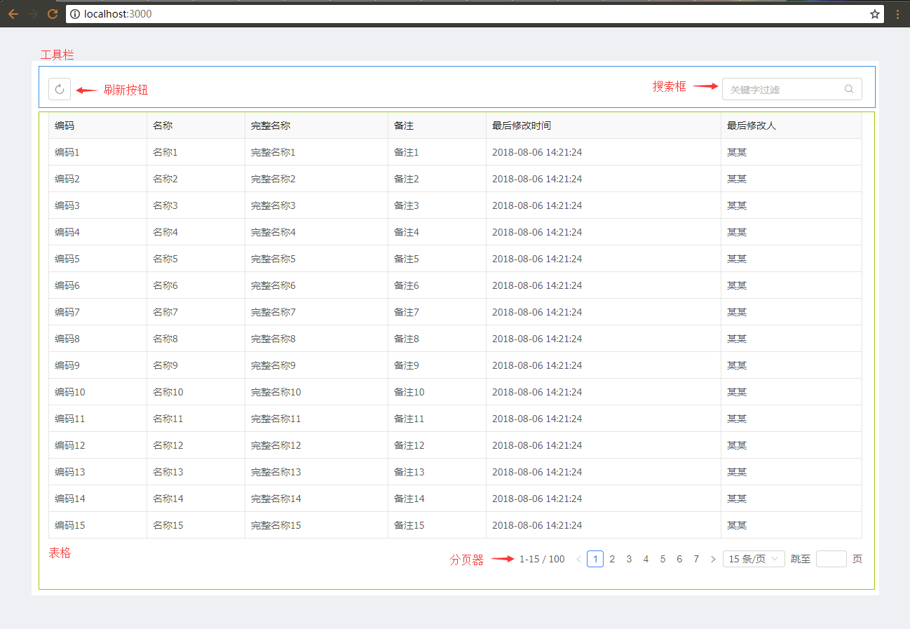
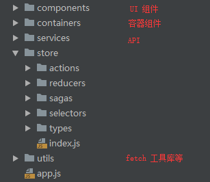
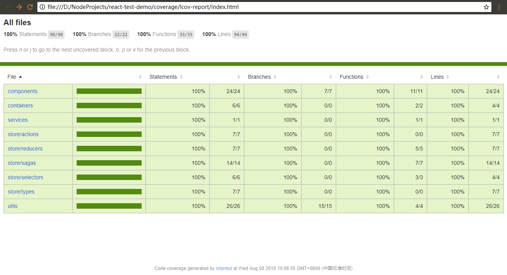

# Web 前端单元测试到底要怎么写？看这一篇就够了

随着 Web 应用的复杂程度越来越高，很多公司越来越重视前端单元测试。我们看到的大多数教程都会讲单元测试的重要性、一些有代表性的测试框架 api 怎么使用，但在实际项目中单元测试要怎么下手？测试用例应该包含哪些具体内容呢？

本文从一个真实的应用场景出发，从设计模式、代码结构来分析单元测试应该包含哪些内容，具体测试用例怎么写，希望看到的童鞋都能有所收获。


## 项目用到的技术框架

该项目采用 `react` 技术栈，用到的主要框架包括：`react`、`redux`、`react-redux`、`redux-actions`、`reselect`、`redux-saga`、`seamless-immutable`、`antd`。


## 应用场景介绍




这个应用场景从 UI 层来讲主要由两个部分组成：

- 工具栏，包含刷新按钮、关键字搜索框
- 表格展示，采用分页的形式浏览


看到这里有的童鞋可能会说：切！这么简单的界面和业务逻辑，还是真实场景吗，还需要写神马单元测试吗？

别急，为了保证文章的阅读体验和长度适中，能讲清楚问题的简洁场景就是好场景不是吗？慢慢往下看。


## 设计模式与结构分析

在这个场景设计开发中，我们严格遵守 `redux` 单向数据流 与 `react-redux` 的最佳实践，并采用 `redux-saga` 来处理业务流，`reselect` 来处理状态缓存，通过 `fetch` 来调用后台接口，与真实的项目没有差异。

分层设计与代码组织如下所示：




中间 `store` 中的内容都是 `redux` 相关的，看名称应该都能知道意思了。

具体的代码请看 [这里](https://github.com/deepfunc/react-test-demo)。


## 单元测试部分介绍

先讲一下用到了哪些测试框架和工具，主要内容包括：

- `jest` ，测试框架
- `enzyme` ，专测 react ui 层
- `sinon` ，具有独立的 fakes、spies、stubs、mocks 功能库
- `nock` ，模拟 HTTP Server


如果有童鞋对上面这些使用和配置不熟的话，直接看官方文档吧，比任何教程都写的好。

接下来，我们就开始编写具体的测试用例代码了，下面会针对每个层面给出代码片段和解析。那么我们先从 `actions` 开始吧。

> 为使文章尽量简短、清晰，下面的代码片段不是每个文件的完整内容，完整内容在 [这里](https://github.com/deepfunc/react-test-demo) 。


## actions

业务里面我使用了 `redux-actions` 来产生  `action`，这里用工具栏做示例，先看一段业务代码：

```javascript
import { createAction } from 'redux-actions';
import * as type from '../types/bizToolbar';

export const updateKeywords = createAction(type.BIZ_TOOLBAR_KEYWORDS_UPDATE);

// ...
```


对于 `actions` 测试，我们主要是验证产生的 `action` 对象是否正确：

```javascript
import * as type from '@/store/types/bizToolbar';
import * as actions from '@/store/actions/bizToolbar';

/* 测试 bizToolbar 相关 actions */
describe('bizToolbar actions', () => {
    
    /* 测试更新搜索关键字 */
    test('should create an action for update keywords', () => {
        // 构建目标 action
        const keywords = 'some keywords';
        const expectedAction = {
            type: type.BIZ_TOOLBAR_KEYWORDS_UPDATE,
            payload: keywords
        };

        // 断言 redux-actions 产生的 action 是否正确
        expect(actions.updateKeywords(keywords)).toEqual(expectedAction);
    });

    // ...
});
```


这个测试用例的逻辑很简单，首先构建一个我们期望的结果，然后调用业务代码，最后验证业务代码的运行结果与期望是否一致。这就是写测试用例的基本套路。

我们在写测试用例时尽量保持用例的单一职责，不要覆盖太多不同的业务范围。测试用例数量可以有很多个，但每个都不应该很复杂。


## reducers

接着是 `reducers`，依然采用  `redux-actions` 的 `handleActions` 来编写 `reducer`，这里用表格的来做示例：

```javascript
import { handleActions } from 'redux-actions';
import Immutable from 'seamless-immutable';
import * as type from '../types/bizTable';

/* 默认状态 */
export const defaultState = Immutable({
    loading: false,
    pagination: {
        current: 1,
        pageSize: 15,
        total: 0
    },
    data: []
});

export default handleActions(
    {
        // ...

        /* 处理获得数据成功 */
        [type.BIZ_TABLE_GET_RES_SUCCESS]: (state, {payload}) => {
            return state.merge(
                {
                    loading: false,
                    pagination: {total: payload.total},
                    data: payload.items
                },
                {deep: true}
            );
        },
        
        // ...
    },
    defaultState
);
```

> 这里的状态对象使用了 `seamless-immutable`


对于 `reducer`，我们主要测试两个方面：

1. 对于未知的 `action.type` ，是否能返回当前状态。
2. 对于每个业务 type ，是否都返回了经过正确处理的状态。


下面是针对以上两点的测试代码：

```javascript
import * as type from '@/store/types/bizTable';
import reducer, { defaultState } from '@/store/reducers/bizTable';

/* 测试 bizTable reducer */
describe('bizTable reducer', () => {
    
    /* 测试未指定 state 参数情况下返回当前缺省 state */
    test('should return the default state', () => {
        expect(reducer(undefined, {type: 'UNKNOWN'})).toEqual(defaultState);
    });
    
    // ...
    
    /* 测试处理正常数据结果 */
    test('should handle successful data response', () => {
        /* 模拟返回数据结果 */
        const payload = {
            items: [
                {id: 1, code: '1'},
                {id: 2, code: '2'}
            ],
            total: 2
        };
        /* 期望返回的状态 */
        const expectedState = defaultState
            .setIn(['pagination', 'total'], payload.total)
            .set('data', payload.items)
            .set('loading', false);

        expect(
            reducer(defaultState, {
                type: type.BIZ_TABLE_GET_RES_SUCCESS,
                payload
            })
        ).toEqual(expectedState);
    });
    
    // ...
});
```


这里的测试用例逻辑也很简单，依然是上面断言期望结果的套路。下面是 selectors 的部分。


## selectors

`selector` 的作用是获取对应业务的状态，这里使用了 `reselect` 来做缓存，防止 `state` 未改变的情况下重新计算，先看一下表格的 selector 代码：

```javascript
import { createSelector } from 'reselect';
import * as defaultSettings from '@/utils/defaultSettingsUtil';

// ...

const getBizTableState = (state) => state.bizTable;

export const getBizTable = createSelector(getBizTableState, (bizTable) => {
    return bizTable.merge({
        pagination: defaultSettings.pagination
    }, {deep: true});
});
```


这里的分页器部分参数在项目中是统一设置，所以 reselect 很好的完成了这个工作：如果业务状态不变，直接返回上次的缓存。分页器默认设置如下：


```javascript
export const pagination = {
    size: 'small',
    showTotal: (total, range) => `${range[0]}-${range[1]} / ${total}`,
    pageSizeOptions: ['15', '25', '40', '60'],
    showSizeChanger: true,
    showQuickJumper: true
};
```


那么我们的测试也主要是两个方面：

1. 对于业务 selector ，是否返回了正确的内容。
2. 缓存功能是否正常。


测试代码如下：

```javascript
import Immutable from 'seamless-immutable';
import { getBizTable } from '@/store/selectors';
import * as defaultSettingsUtil from '@/utils/defaultSettingsUtil';

/* 测试 bizTable selector */
describe('bizTable selector', () => {
    
    let state;

    beforeEach(() => {
        state = createState();
        /* 每个用例执行前重置缓存计算次数 */
        getBizTable.resetRecomputations();
    });

    function createState() {
        return Immutable({
            bizTable: {
                loading: false,
                pagination: {
                    current: 1,
                    pageSize: 15,
                    total: 0
                },
                data: []
            }
        });
    }

    /* 测试返回正确的 bizTable state */
    test('should return bizTable state', () => {
        /* 业务状态 ok 的 */
        expect(getBizTable(state)).toMatchObject(state.bizTable);
        
        /* 分页默认参数设置 ok 的 */
        expect(getBizTable(state)).toMatchObject({
            pagination: defaultSettingsUtil.pagination
        });
    });

    /* 测试 selector 缓存是否有效 */
    test('check memoization', () => {
        getBizTable(state);
        /* 第一次计算，缓存计算次数为 1 */
        expect(getBizTable.recomputations()).toBe(1);
        
        getBizTable(state);
        /* 业务状态不变的情况下，缓存计算次数应该还是 1 */
        expect(getBizTable.recomputations()).toBe(1);
        
        const newState = state.setIn(['bizTable', 'loading'], true);
        getBizTable(newState);
        /* 业务状态改变了，缓存计算次数应该是 2 了 */
        expect(getBizTable.recomputations()).toBe(2);
    });
});
```


测试用例依然很简单有木有？保持这个节奏就对了。下面来讲下稍微有点复杂的地方，sagas 部分。


## sagas

这里我用了 `redux-saga` 处理业务流，这里具体也就是异步调用 api 请求数据，处理成功结果和错误结果等。

可能有的童鞋觉得搞这么复杂干嘛，异步请求用个 `redux-thunk` 不就完事了吗？别急，耐心看完你就明白了。


这里有必要大概介绍下  `redux-saga` 的工作方式。saga 是一种 `es6` 的生成器函数 - Generator ，我们利用他来产生各种声明式的 `effects` ，由   `redux-saga` 引擎来消化处理，推动业务进行。


这里我们来看看获取表格数据的业务代码：

```javascript
import { all, takeLatest, put, select, call } from 'redux-saga/effects';
import * as type from '../types/bizTable';
import * as actions from '../actions/bizTable';
import { getBizToolbar, getBizTable } from '../selectors';
import * as api from '@/services/bizApi';

// ...

export function* onGetBizTableData() {
    /* 先获取 api 调用需要的参数：关键字、分页信息等 */
    const {keywords} = yield select(getBizToolbar);
    const {pagination} = yield select(getBizTable);

    const payload = {
        keywords,
        paging: {
            skip: (pagination.current - 1) * pagination.pageSize, max: pagination.pageSize
        }
    };

    try {
        /* 调用 api */
        const result = yield call(api.getBizTableData, payload);
        /* 正常返回 */
        yield put(actions.putBizTableDataSuccessResult(result));
    } catch (err) {
        /* 错误返回 */
        yield put(actions.putBizTableDataFailResult());
    }
}
```


不熟悉 `redux-saga` 的童鞋也不要太在意代码的具体写法，看注释应该能了解这个业务的具体步骤：

1. 从对应的 `state` 里取到调用 api 时需要的参数部分（搜索关键字、分页），这里调用了刚才的 selector。
2. 组合好参数并调用对应的 api 层。
3. 如果正常返回结果，则发送成功 action 通知 reducer 更新状态。
4. 如果错误返回，则发送错误 action 通知 reducer。


那么具体的测试用例应该怎么写呢？我们都知道这种业务代码涉及到了 api 或其他层的调用，如果要写单元测试必须做一些 mock 之类来防止真正调用 api 层，下面我们来看一下 怎么针对这个 saga 来写测试用例：

```javascript
import { put, select } from 'redux-saga/effects';

// ...

/* 测试获取数据 */
test('request data, check success and fail', () => {
    /* 当前的业务状态 */
    const state = {
        bizToolbar: {
            keywords: 'some keywords'
        },
        bizTable: {
            pagination: {
                current: 1,
                pageSize: 15
            }
        }
    };
    const gen = cloneableGenerator(saga.onGetBizTableData)();

    /* 1. 是否调用了正确的 selector 来获得请求时要发送的参数 */
    expect(gen.next().value).toEqual(select(getBizToolbar));
    expect(gen.next(state.bizToolbar).value).toEqual(select(getBizTable));

    /* 2. 是否调用了 api 层 */
    const callEffect = gen.next(state.bizTable).value;
    expect(callEffect['CALL'].fn).toBe(api.getBizTableData);
    /* 调用 api 层参数是否传递正确 */
    expect(callEffect['CALL'].args[0]).toEqual({
        keywords: 'some keywords',
        paging: {skip: 0, max: 15}
    });

    /* 3. 模拟正确返回分支 */
    const successBranch = gen.clone();
    const successRes = {
        items: [
            {id: 1, code: '1'},
            {id: 2, code: '2'}
        ],
        total: 2
    };
    expect(successBranch.next(successRes).value).toEqual(
        put(actions.putBizTableDataSuccessResult(successRes)));
    expect(successBranch.next().done).toBe(true);

    /* 4. 模拟错误返回分支 */
    const failBranch = gen.clone();
    expect(failBranch.throw(new Error('模拟产生异常')).value).toEqual(
        put(actions.putBizTableDataFailResult()));
    expect(failBranch.next().done).toBe(true);
});
```


这个测试用例相比前面的复杂了一些，我们先来说下测试 saga 的原理。前面说过 saga 实际上是返回各种声明式的 `effects` ，然后由引擎来真正执行。所以我们测试的目的就是要看 `effects` 的产生是否符合预期。那么`effect` 到底是个神马东西呢？其实就是字面量对象！

我们可以用在业务代码同样的方式来产生这些字面量对象，对于字面量对象的断言就非常简单了，并且没有直接调用 api 层，就用不着做 mock 咯！这个测试用例的步骤就是利用生成器函数一步步的产生下一个 `effect` ，然后断言比较。

> 从上面的注释 3、4 可以看到，`redux-saga` 还提供了一些辅助函数来方便的处理分支断点。


这也是我选择 `redux-saga` 的原因：强大并且利于测试。


## api 和 fetch 工具库

接下来就是api 层相关的了。前面讲过调用后台请求是用的 `fetch` ，我封装了两个方法来简化调用和结果处理：`getJSON()` 、`postJSON()` ，分别对应 GET 、POST 请求。先来看看 api 层代码：

```javascript
import { fetcher } from '@/utils/fetcher';

export function getBizTableData(payload) {
    return fetcher.postJSON('/api/biz/get-table', payload);
}
```


业务代码很简单，那么测试用例也很简单：

```javascript
import sinon from 'sinon';
import { fetcher } from '@/utils/fetcher';
import * as api from '@/services/bizApi';

/* 测试 bizApi */
describe('bizApi', () => {
    
    let fetcherStub;

    beforeAll(() => {
        fetcherStub = sinon.stub(fetcher);
    });

    // ...

    /* getBizTableData api 应该调用正确的 method 和传递正确的参数 */
    test('getBizTableData api should call postJSON with right params of fetcher', () => {
        /* 模拟参数 */
        const payload = {a: 1, b: 2};
        api.getBizTableData(payload);

        /* 检查是否调用了工具库 */
        expect(fetcherStub.postJSON.callCount).toBe(1);
        /* 检查调用参数是否正确 */
        expect(fetcherStub.postJSON.lastCall.calledWith('/api/biz/get-table', payload)).toBe(true);
    });
});
```


由于 api 层直接调用了工具库，所以这里用 `sinon.stub()` 来替换工具库达到测试目的。


接着就是测试自己封装的 fetch 工具库了，这里 fetch 我是用的 `isomorphic-fetch` ，所以选择了 `nock` 来模拟 Server 进行测试，主要是测试正常访问返回结果和模拟服务器异常等，示例片段如下：

```javascript
import nock from 'nock';
import { fetcher, FetchError } from '@/utils/fetcher';

/* 测试 fetcher */
describe('fetcher', () => {

    afterEach(() => {
        nock.cleanAll();
    });

    afterAll(() => {
        nock.restore();
    });

    /* 测试 getJSON 获得正常数据 */
    test('should get success result', () => {
        nock('http://some')
            .get('/test')
            .reply(200, {success: true, result: 'hello, world'});

        return expect(fetcher.getJSON('http://some/test')).resolves.toMatch(/^hello.+$/);
    });

    // ...

    /* 测试 getJSON 捕获 server 大于 400 的异常状态 */
    test('should catch server status: 400+', (done) => {
        const status = 500;
        nock('http://some')
            .get('/test')
            .reply(status);

        fetcher.getJSON('http://some/test').catch((error) => {
            expect(error).toEqual(expect.any(FetchError));
            expect(error).toHaveProperty('detail');
            expect(error.detail.status).toBe(status);
            done();
        });
    });

   /* 测试 getJSON 传递正确的 headers 和 query strings */
    test('check headers and query string of getJSON()', () => {
        nock('http://some', {
            reqheaders: {
                'Accept': 'application/json',
                'authorization': 'Basic Auth'
            }
        })
            .get('/test')
            .query({a: '123', b: 456})
            .reply(200, {success: true, result: true});

        const headers = new Headers();
        headers.append('authorization', 'Basic Auth');
        return expect(fetcher.getJSON(
            'http://some/test', {a: '123', b: 456}, headers)).resolves.toBe(true);
    });
    
    // ...
});
```


基本也没什么复杂的，主要注意 fetch 是 promise 返回，`jest` 的各种异步测试方案都能很好满足。

剩下的部分就是跟  UI 相关的了。


## 容器组件

容器组件的主要目的是传递 state 和 actions，看下工具栏的容器组件代码：

```javascript
import { connect } from 'react-redux';
import { getBizToolbar } from '@/store/selectors';
import * as actions from '@/store/actions/bizToolbar';
import BizToolbar from '@/components/BizToolbar';

const mapStateToProps = (state) => ({
    ...getBizToolbar(state)
});

const mapDispatchToProps = {
    reload: actions.reload,
    updateKeywords: actions.updateKeywords
};

export default connect(mapStateToProps, mapDispatchToProps)(BizToolbar);
```


那么测试用例的目的也是检查这些，这里使用了 `redux-mock-store` 来模拟 redux 的 store ：

```react
import React from 'react';
import { shallow } from 'enzyme';
import configureStore from 'redux-mock-store';
import BizToolbar from '@/containers/BizToolbar';

/* 测试容器组件 BizToolbar */
describe('BizToolbar container', () => {
    
    const initialState = {
        bizToolbar: {
            keywords: 'some keywords'
        }
    };
    const mockStore = configureStore();
    let store;
    let container;

    beforeEach(() => {
        store = mockStore(initialState);
        container = shallow(<BizToolbar store={store}/>);
    });

    /* 测试 state 到 props 的映射是否正确 */
    test('should pass state to props', () => {
        const props = container.props();

        expect(props).toHaveProperty('keywords', initialState.bizToolbar.keywords);
    });

    /* 测试 actions 到 props 的映射是否正确 */
    test('should pass actions to props', () => {
        const props = container.props();

        expect(props).toHaveProperty('reload', expect.any(Function));
        expect(props).toHaveProperty('updateKeywords', expect.any(Function));
    });
});
```


很简单有木有，所以也没啥可说的了。


## UI 组件

这里以表格组件作为示例，我们将直接来看测试用例是怎么写。一般来说 UI 组件我们主要测试以下几个方面：

- 是否渲染了正确的 DOM 结构
- 样式是否正确
- 业务逻辑触发是否正确


下面是测试用例代码：

```react
import React from 'react';
import { mount } from 'enzyme';
import sinon from 'sinon';
import { Table } from 'antd';
import * as defaultSettingsUtil from '@/utils/defaultSettingsUtil';
import BizTable from '@/components/BizTable';

/* 测试 UI 组件 BizTable */
describe('BizTable component', () => {
    
    const defaultProps = {
        loading: false,
        pagination: Object.assign({}, {
            current: 1,
            pageSize: 15,
            total: 2
        }, defaultSettingsUtil.pagination),
        data: [{id: 1}, {id: 2}],
        getData: sinon.fake(),
        updateParams: sinon.fake()
    };
    let defaultWrapper;

    beforeEach(() => {
        defaultWrapper = mount(<BizTable {...defaultProps}/>);
    });

    // ...

    /* 测试是否渲染了正确的功能子组件 */
    test('should render table and pagination', () => {
        /* 是否渲染了 Table 组件 */
        expect(defaultWrapper.find(Table).exists()).toBe(true);
        /* 是否渲染了 分页器 组件，样式是否正确（mini） */
        expect(defaultWrapper.find('.ant-table-pagination.mini').exists()).toBe(true);
    });

    /* 测试首次加载时数据列表为空是否发起加载数据请求 */
    test('when componentDidMount and data is empty, should getData', () => {
        sinon.spy(BizTable.prototype, 'componentDidMount');
        const props = Object.assign({}, defaultProps, {
            pagination: Object.assign({}, {
                current: 1,
                pageSize: 15,
                total: 0
            }, defaultSettingsUtil.pagination),
            data: []
        });
        const wrapper = mount(<BizTable {...props}/>);

        expect(BizTable.prototype.componentDidMount.calledOnce).toBe(true);
        expect(props.getData.calledOnce).toBe(true);
        BizTable.prototype.componentDidMount.restore();
    });

    /* 测试 table 翻页后是否正确触发 updateParams */
    test('when change pagination of table, should updateParams', () => {
        const table = defaultWrapper.find(Table);
        table.props().onChange({current: 2, pageSize: 25});
        expect(defaultProps.updateParams.lastCall.args[0])
            .toEqual({paging: {current: 2, pageSize: 25}});
    });
});
```


得益于设计分层的合理性，我们很容易利用构造 `props` 来达到测试目的，结合 `enzyme` 和 `sinon` ，测试用例依然保持简单的节奏。


## 总结

以上就是这个场景完整的测试用例编写思路和示例代码，文中提及的思路方法也完全可以用在 `Vue` 、`Angular` 项目上。完整的代码内容在 [这里](https://github.com/deepfunc/react-test-demo) （重要的事情多说几遍，各位童鞋觉得好帮忙去给个 :star: 哈）。

最后我们可以利用覆盖率来看下用例的覆盖程度是否足够（一般来说不用刻意追求 100%，根据实际情况来定）：




单元测试是 TDD 测试驱动开发的基础。从以上整个过程可以看出，好的设计分层是很容易编写测试用例的，单元测试不单单只是为了保证代码质量：他会逼着你思考代码设计的合理性，拒绝面条代码  :muscle: 


借用 Clean Code 的结束语：

> 2005 年，在参加于丹佛举行的敏捷大会时，Elisabeth Hedrickson 递给我一条类似 Lance Armstrong 热销的那种绿色腕带。这条腕带上面写着“沉迷测试”（Test Obsessed）的字样。我高兴地戴上，并自豪地一直系着。自从 1999 年从 Kent Beck 那儿学到 TDD 以来，我的确迷上了测试驱动开发。
>
> 不过跟着就发生了些奇事。我发现自己无法取下腕带。不仅是因为腕带很紧，而且那也是条精神上的紧箍咒。那腕带就是我职业道德的宣告，也是我承诺尽己所能写出最好代码的提示。取下它，仿佛就是违背了这些宣告和承诺似的。
>
>  
>
> 所以它还在我的手腕上。在写代码时，我用余光瞟见它。它一直提醒我，我做了写出整洁代码的承诺。

